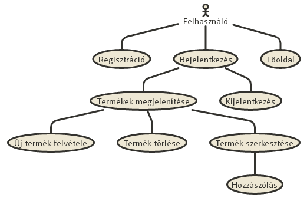
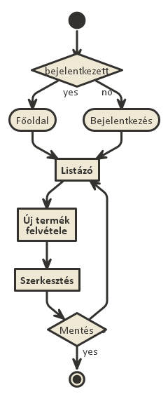
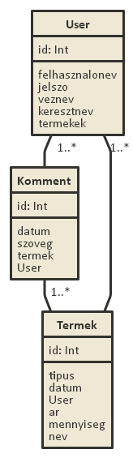

#### ELTE IK - HO92MS - Németh Dávid - Alkalmazások fejlesztése - 1. beadandó
------

## Dokumentáció - Raktár bevételezés - Németh Dávid - HO92MS

###1. Követelmények elemzése a [példadokumentáció](http://webprogramozas.inf.elte.hu/alkfejl/A_dokumentacio_felepitese.pdf) és a tárgy [weblapja](http://webprogramozas.inf.elte.hu/alkfejl.php) alapján.

#####1.1 Célkitűzés, projektindító dokumentum
A program célja, hogy átláthatóvá tegye egy raktár árukészletét, azaz megjelenítse az általa tárolt termékek tulajdonságait. A főbb szolgáltatások regisztráció után válnak elérhetővé. A bejelentkezést követően lehetőségünk nyílik megtekinteni, szerkeszteni, törölni a raktár tartalmát és megjegyzéssel illethetjük az adott árut.

######Funkcionális követelmények:
* Regisztráció
* Bejelentkezés
* A login után elérhető funkciók:
  - új termék felvétele a raktárba
  - a meglévő termék szerkesztése
  - a meglévő termék törlése
  - hozzászólás

######Nem funkcionális követelmények:
*	**Könnyű áttekinthetőség:** Típus szerinti csoportosítás
*	**Használhatóság:** Könnyű, érthető elrendezés; könnyű kezelhetőség
*	**Megbízhatóság:** Beviteli mezők megfelelő védelme, visszajelzésük egyértelműsége
*	**Karbantarthatóság:** Más fejlesztő számára is átlátható fájlszerkezet, "beszédes kód" alkalmazása

#####1.2.	Szakterületi fogalomjegyzék

**Típusok:**
* **Vasáru:** Építkezésekhez, szereléshez használt fémekből készült szerkezeti anyagok.
* **Faáru:** Kül- és beltéri felhasználásra szánt faanyagok, fából készült termékek.
* **Törékeny:** Többnyire értékes iparművészeti termékek, mint például: porcelánból készült díszek, (carrarai-) márvány, jádekő... stb.
* **Elektronikus:** Minden elektronikai eszköz, amely tárolódhat vízpára mentes raktáron.

#####1.3.	Használati-esetmodell, funkcionális követelmények

**Vendég**: Csak a publikus oldalakat éri el

*	Főoldal
*	Bejelentkezés
*	Regisztráció

**Bejelentkezett felhasználó**: A publikus oldalak elérésén felül egyéb funkciókhoz is hozzáfér.

*	Új termék felvétele
*	Meglévő termék megtekintése
*	Meglévő termék szerkesztése
*	Meglévő termék törlése
*	Hozzászólás

Példafolyamat:

**Új raktári termék felvétele:**

1.	A felhasználó (regisztrálás után) bejelentkezik
2.	Megtekintheti a raktár tartalmát listázó oldalt.
3.	Rákattint az Új termék gombra
4.	A beviteli oldalon megadja az új adatokat
5.	Mentés gombra kattintva elmenti a változásokat

####2. Architektúra terv

######2.1. Oldaltérkép:

**Publikus:**
* Főoldal
* Bejelentkezés
* Regisztráció

**Bejelentkezett:**
* Főoldal
* Új termék felvétele
* Lista-oldal
  * Termék törlése 
  * Termék megtekintése
    * Termék szerkesztése 
    * Hozzászólás

######2.2. Végpontok

* GET/: főoldal
* GET/login: bejelentkező oldal
* POST/login: bejelentkezési adatok elküldése
* GET/login/signup: regisztrációs oldal
* POST/login/signup: regisztrációs adatok elküldése
* GET/logout: kijelentkező oldal
* GET/raktr/list: raktári terméklista oldal
* GET/raktr/new: új raktári termék felvétele
* POST/raktr/new: új raktári termék felvételéhez szükséges adatok elküldése
* GET/raktr/id: raktári termék adatok
* POST/raktr/id: új hozzászólás felvitele
* GET/raktr/delete=id: raktári termék törlése
* GET/raktr/edit=id: raktári termék módosítása
* POST/raktr/edit=id: raktári termék módosítása, adatok elküldése

######2.2.1. Adatmodell

